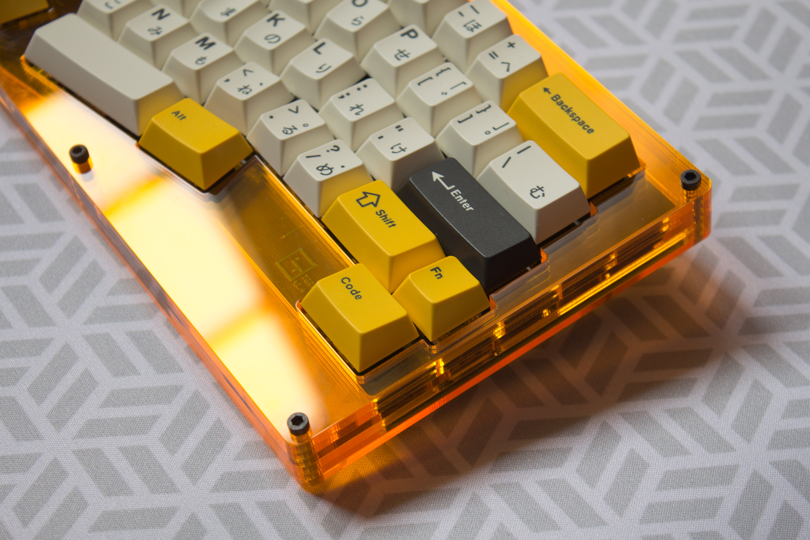
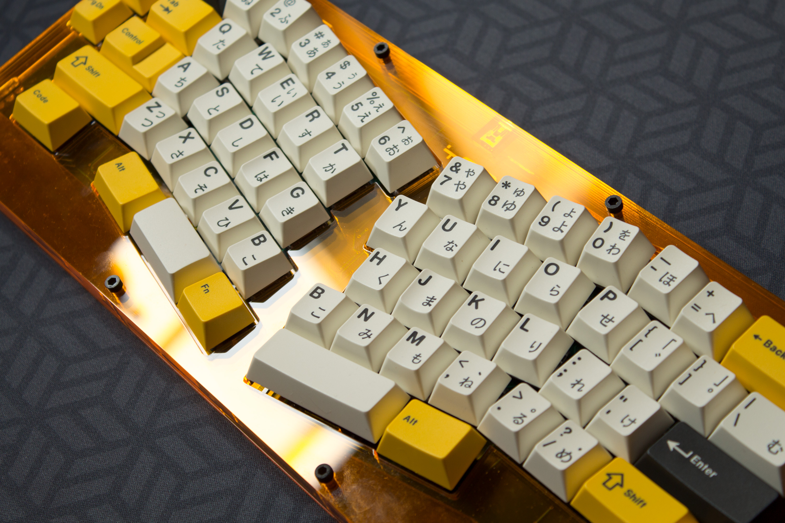
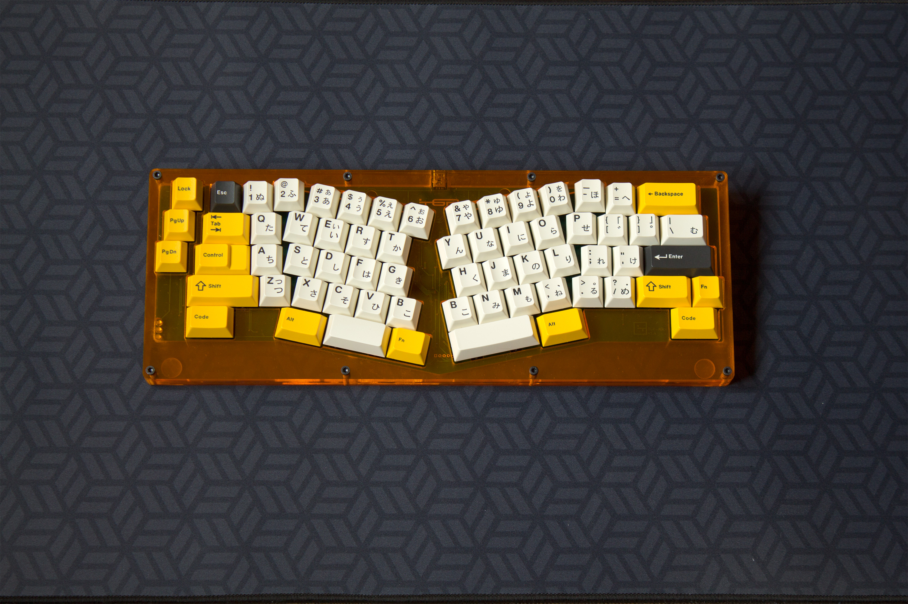

# Lubrigante

_A TGR Alice Acrylic Case Revision By Zambumon_

### CHECK THE ISSUES TAB BEFORE MAKING THIS CASE

The aim of this project is to revisit the TGR Alice acrylic case (designed by Yuktsi), and host a guide with some basic resources so you can make your own.

You can find Yuktsi's original case files [here](https://geekhack.org/index.php?topic=95054.msg2661499#msg2661499).

### Differences between Lubrigante and Alice

- 4mm corners and a smaller footprint
- Top piece opening has now round corners instead of sharp ones
- Compatible with screw-in stabs.
- Fixed layout both for half-plate and full-plate.

# Disclaimer

**THIS IS A WORK IN PROGRESS PROJECT. USE THE FILES AT YOUR OWN RISK**

## Available layouts:

- **MAN OF LAYOUTS**: fixed layout. Stepped caps lock, 2.00U space bar next to a 1.25U modifier, standard backspace.
  - **Half plate**
  - ~~**Full plate**~~ _reworking_

---

## Making the case

When importing the files, make sure to **set the scale to millimetres**. **The keyboard should be 348.8mm wide.**

The case is made with multiple layers of acrylic that are stacked on top of each other and held together with 8 M3 screws. Each file has 5 distinct pieces:
- **Piece A - Top opening**: this is the top piece of the of the case, the one with two openings. This piece is placed on top of the plate.
- **Piece B - Plate**: used to hold the switches, it is the one with switch and stab holes. On the left side lower corner it has a slot for the LEDs.
- **Piece C - Upper USB**: this piece is placed right under the plate and it is necessary for 3mm or lower plates. With a 5mm plates, you won't need it.
- **Piece D - Lower USB***: meant to be placed right on top of the bottom piece, the only difference with **Piece C** is the lack of an exit for the USB port.
- **Piece E - Bottom piece**: the one that closes the case. It has 3 M4 holes so you can install either 3 cone feet.

### Layer thicknesses: what are your alternatives?

- **3mm pieces**: probably the most versatile solution, as there are lots of acrylic finishes and it is the one I used while prototyping. It consists on **6 layers** of 3mm acrylic: 2x Piece A, 1x Piece B, 1x Piece C, 1x Piece D, and 1x Piece E.
- **5mm pieces**: this might look in the beginning as a more cost effective solution, but that might not be the case. The shop will probably use a bigger kerf to make the pieces, and that would be problematic for both most of them, specially the plate. If you decide to go with this route, there are two possibilities:
  - 1x Piece A, 1x Piece B, 1x Piece D, 1x Piece E.
  - 1x Piece A, 1x Piece C, 1x Piece D, 1x Piece E + a non-acrylic 1.5mm Piece B (either aluminum, brass, copper, carbon fiber, etc.).
- **The TGR way**: The original case used 3 different acrylic thicknesses: an 8mm Piece A, 5mm Piece B, 5mm Piece D, and 3mm Piece E. It had 8 countersunk M3 holes: 8 on Piece A, and two M4 countersunk on the Piece E. Additionally, its Piece E had 8 of its screw holes tapped.
- **Mix of 3mm and 5mm layers**: one possibility could be 1x 3mm Piece A, 1x 5mm Piece A, 1x 3mm Piece B, 1x 5mm Piece C, 1x 3mm Piece D, 1x 3mm Piece E.

###  Ordering the acrylic pieces

There are a handful of ways of getting the acrylic pieces done:
- Contacting a local maker spaces or a laser cutting shop.
- Ordering online:
  - [Ponoko](https://www.ponoko.com) (NA)
  - [Formulor](https://www.formulor.de) (EU) I have used their service for the prototype. Shipping will be expensive as they have to use a large sheet of acrylic, so ordering multiple cases is recommended. The case will end up costing around 75 EUR + shipping.

### Other components

- PCB: you can use the original TGR Alice PCB or the one [Maarten Dekkers](https://github.com/Maartenwut) has designed and that will be available for purchase soon.
- [CNCd aluminum cone feet](http://lmgtfy.com/?q=cnc+aluminum+cone+feet). These will most likely come with M4 screws.
- Bumpons: I recommend using some `SJ5302 3M`, as these are very similar to the ones used by the CNCd cone feet.
- Screws:
  - 8x M3 x 20mm (or more) screws. The original acrylic TGR Alice used flat head nylon screws. I've used some hex socket screws. Ideally you'd want to use 20+ screws and some nuts.

---

## License

This repository is under the [GNU GPL V3 license](./LICENSE). If you plan to sell these cases, make sure to read it.
