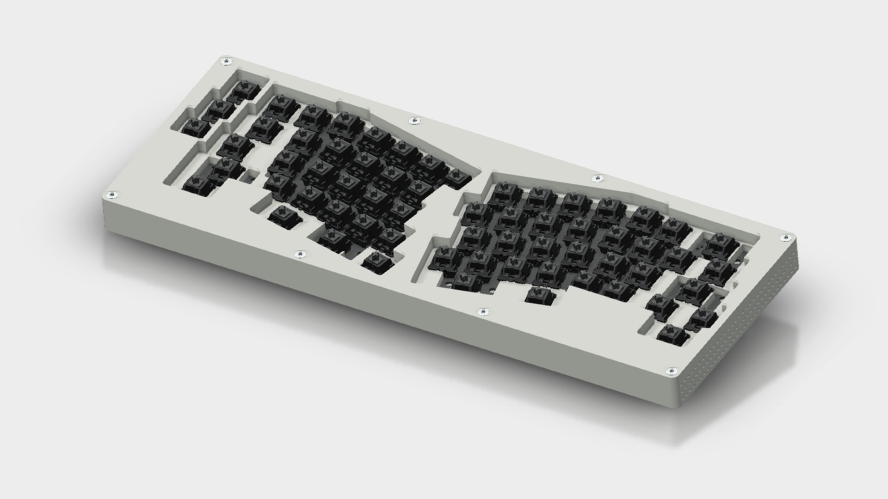
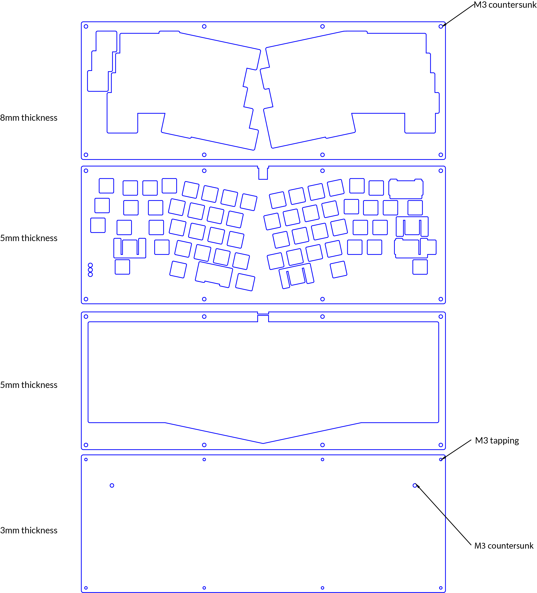

# Lubrigante

_A TGR Alice Acrylic Case Revision By Zambumon_

The aim of this project is to revisit the TGR Alice acrylic case (designed by Yuktsi), and host a guide with some basic resources so you can make your own.

You can find Yuktsi's original case files [here](https://geekhack.org/index.php?topic=95054.msg2661499#msg2661499).

### Differences between Lubrigante and Alice

- 4mm corners and a smaller footprint
- Top piece opening has now round corners instead of sharp ones
- Reworked stabs footprint
- Fixed layout both for half-plate and full-plate.

# Disclaimer

**THIS IS A WORK IN PROGRESS PROJECT. USE THE FILES AT YOUR OWN RISK**

## Available layouts:

- **MAN OF LAYOUTS**: fixed layout. Stepped caps lock, 2.00U space bar next to a 1.25U modifier, standard backspace.
  - **Half plate**
  - **Full plate**

---

## Making the case

When importing the files, make sure to **set the scale to millimetres**. The pieces should be 348.8mm wide, and 536mm tall.

The case is composed by 4 pieces that will get held together by 8 M3 screws. The original case used 3 different acrylic thicknesses: an 8mm top, 5mm plate, 5mm middle piece, and 3mm bottom.

The original design had 10 countersunk M3 holes: 8 on the top piece, and two on the base piece. Additionally, the base piece had 8 of its screw holes tapped.

_Screenshot of TGR's guidelines for the acrylic case_

While it is possible to make the case by just using four 5mm thick pieces of acrylic, it is not recommended, as the switches would still be visible when finishing assembly.

###  Ordering the acrylic pieces

There are a handful of ways of getting the acrylic pieces done:
- Contacting a local maker spaces or a laser cutting shop
- Ordering online:
  - [Ponoko](https://www.ponoko.com) (NA)
  - [Sculpteo](https://www.sculpteo.com/) (EU)
- Joining a group buy

### Other components

- PCB: This is a WIP.
- [CNCd aluminum cone feet](http://lmgtfy.com/?q=cnc+aluminum+cone+feet)
- Bumpons: I recommend using some `SJ5302 3M`, as these are very similar to the ones used by the CNCd cone feet.
- Screws:
  - 8x M3 x 20mm screws. Preferrably flat head screws if you get the 8mm piece countersunk. The original acrylic TGR Alice used plastic of nylon screws.
  - 2x M3 x 10mm (or less) screws. Usually, these two come with the cone feet.

---

## License

This repository is under the [GNU GPL V3 license](./LICENSE)
